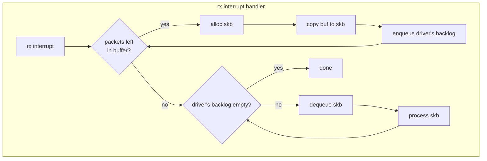

> NET_BH는 1992년에 개발된 기술로, 개발 배경과 관련된 자료가 거의 남아 있지 않습니다. 따라서 아래 설명에는 이후 기술 흐름을 바탕으로 한 추론이 일부 포함되어 있습니다.

# The first ethernet driver: *we*

리눅스 커널 v0.98에서 TCP/IP 스택이 도입되면서, 이에 맞춰 첫 번째 이더넷 드라이버인 *we*가 추가되었습니다. [mailing list](https://kernel.googlesource.com/pub/scm/linux/kernel/git/nico/archive/+/refs/tags/v0.98)

*we* 드라이버는 Western Digital의 WD8003 및 WD8013 네트워크 카드를 지원했으며, Ross Biro가 개발했습니다.

## interrupt-driven packet processing

*we*는 패킷 수신을 감지하고 처리하기 위해 인터럽트를 사용했습니다. NIC이 패킷을 CPU 메모리로 DMA 한 후 인터럽트를 발생시키면, 드라이버의 인터럽트 핸들러가 이를 처리하는 구조입니다. 이는 주변장치가 이벤트를 알리고 CPU가 이를 처리하는 전형적인 이벤트 기반 데이터 처리 모델입니다.

## How *we* process received packets



*we*의 인터럽트 핸들러는 다음 순서로 수신 패킷을 처리합니다.
1. 패킷 구조체(skb) 할당
2. 드라이버 버퍼에서 skb로 데이터 복사
3. 드라이버의 backlog 큐에 보관
4. backlog에서 하나씩 꺼내 상위 네트워크 계층으로 전달

<details>
<summary>소스 코드와 함께 보기</summary>

*we*의 패킷 처리 함수 [`wd_rcv`](https://elixir.bootlin.com/linux/0.98/source/net/tcp/we.c#L303)를 간략화하면 다음과 같습니다.

```c
void wd_rcv(struct device *dev)
{
    struct wd_ring *ring;
    int last_used = wd_get_last_used(dev);
    int last_recv = wd_get_last_recv(dev);
    int pkt_idx = wrap_around(last_used + 1);
    int done = 0;

    while(!done) {
        if (pkt_idx != last_recv) {
            ring = wd_get_buffer(dev, pkt_idx);

            // Build an skb and queue it to dev->backlog
            dev_rint(ring->ptr, ring->len, dev);

            pkt_idx = wrap_around(pkt_idx + 1);
            wd_update_last_used(dev);
        }
        else {
            // Process all queued skbs
            done = dev_rint(NULL, 0, dev);
        }
    }
}
```
</details>

## What happens when packet arrival increases?

패킷 수신량이 많아지면 인터럽트 기반 이벤트 처리 모델은 한계를 드러냅니다.

인터럽트 핸들러는 항상 최우선으로 실행되므로, 패킷이 수신량에 비례해 인터럽트 처리에 CPU를 소모하게 됩니다. 점점 패킷 수신량이 늘어나면 점점 사용자 프로세스가 실행될 기회가 줄어들고, 결국 드라이버는 계속 패킷을 수신하지만 프로세스가 처리하지 못해 모두 버려지는 *인터럽트 라이브락(interrupt livelock)*이 발생하게 됩니다.
[관련1](https://web.stanford.edu/class/cs240/readings/livelock.pdf)

인터럽트 기반 처리는 적은 부하에서는 효율적이지만, 패킷 수신량이 증가할수록 효율이 낮아지고 심각한 문제를 발생시킵니다.


# Introduction of the top/bottom half concept

그러면, 인터럽트 처리에 CPU가 모두 사용되는 것을 막는 방법은 뭘까요? 가장 단순한 방법은 패킷을 *적절히* 버리는 것입니다. 즉, 시스템이 감당 가능한 트래픽만 처리하는 것이죠.

또 다른 방법은 인터럽트 핸들러의 실행 시간을 제한하는 것입니다. 인터럽트 핸들러에서 모든 작업을 처리하지 않고, 꼭 필요한 최소한의 작업만 즉시 수행하고 나머지는 나중으로 미루는 것이죠.

이때 활용되는 기법이 바로 top-half / bottom-half입니다. ([wikipedia](https://en.wikipedia.org/wiki/Interrupt_handler#Divided_handlers_in_modern_operating_systems))
- Top-half: 즉시 처리해야 하는 긴급 작업만 수행
- Bottom-half: 덜 긴급한 작업을 지연하여 실행

이렇게 역할을 분리하면 인터럽트 핸들러가 CPU가 모두 사용하는 것을 막고 사용자 프로세스가 실행될 시간을 줄 수 있게 됩니다.

## The advent of INET_BH

*we*의 인터럽트 핸들러는 크게 두 가지 일을 담당했습니다.
- 드라이버 버퍼 비우기: 패킷 구조체(skb)를 할당하고, NIC 버퍼에서 데이터를 복사
- 패킷 처리: 생성된 skb를 네트워크 스택으로 넘겨 프로토콜별 처리 수행

드라이버 입장에서는 첫 번째 작업은 *즉시 처리해야 하는 일(top-half)*이고, 두 번째 작업은 *조금 늦게 처리해도 되는 일(bottom-half)*입니다.

이를 적용한 것이 INET_BH입니다.
- 드라이버 버퍼 비우기: top-half
- 패킷 처리: bottom-half

드라이버가 패킷을 커널로 전달하는 API인 `dev_rint`는 `backlog` 큐에 패킷을 넣은 후, 이후 bottom-half가 실행되어 큐에 보관된 패킷들을 처리합니다.

## INET_BH improvements

INET_BH로 수신 절차를 두 단계로 나눴지만, 수신량이 매우 늘어나면 top half의 처리 시간이 길어져 bottom half가 실행될 기회 자체를 잃는 라이브락이 다시 나타납니다.

이 때문에 리눅스 1.0.1에는 top-half와 bottom-half가 공유하는 큐인 `backlog`의 길이 제한이 도입되었습니다. 큐에 보관되는 패킷 상한(100개)가 넘어가면 top-half에서 처리된 패킷은 버려지게 되었습니다.

여기서 중요한 변화는 패킷이 버려지는 시점입니다. INET_BH 이전에는 패킷이 소켓 버퍼 단계에서 드랍되었지만, INET_BH 도입 이후에는 backlog 큐에서 **일찍** 드랍되도록 바뀌었습니다.


# Rename to NET_BH

최초의 INET_BH는 TCP/IP 처리를 위해 리눅스 0.99에서 도입되었습니다. 이후 리눅스가 지원하는 네트워크 프로토콜 종류가 점차 증가했고, 그중 일부는 1.1.4 버전부터 INET_BH를 사용하기 시작했습니다. 이는 INET_BH가 TCP/IP 전용이 아닌, 일반적인 네트워크 패킷 처리 메커니즘이었기 때문입니다.

INET는 IPv4를 말하는데, IPv4 이외의 프로토콜들까지 INET_BH를 사용하게 되면서 이름이 부정확해졌습니다. 이 때문에 INET_BH는 보다 범용적인 이름인 *NET_BH*로 변경한 것으로 보이며, 이 변경은 리눅스 1.1.13에서 이루어졌습니다.

## NET_BH improvements | more

NET_BH는 리눅스 1.1.72에서 `backlog` 큐 길이가 300으로 증가했으며, 이후 리눅스 2.1.79에서 `backlog` 큐 길이를 sysfs을 통해 변경(`netdev_max_backlog`) 할 수 있도록 개선되었습니다.

<details>
<summary>부록: dev_rint</summary>

dev_rint(device receive interrupt로 추정) API는 커널 v1.3.60에서 제거되었습니다.

이 API는 초기 두 가지 역할을 담당했습니다.
- 새로운 skb를 할당하고 수신 데이터를 복사
- 생성된 skb를 backlog 큐에 추가

그러나 커널 v0.99.13부터는 두 작업이 분리되었습니다.
- 첫 번째 작업은 `dev_rint`가 수행
- 두 번째 작업은 새로운 API인 `netif_rx`가 수행

이후 `dev_rint`를 사용하는 드라이버는 점차 줄어들었고, v1.3.6 이후에는 더 이상 어떤 드라이버도 이 API를 사용하지 않았습니다. 이는 버퍼 할당 작업을 커널에서 드라이버로 옮겨, 데이터 복사 과정을 제거함으로써 성능을 개선하기 위함으로 보입니다. `netif_rx`는 현재도 사용되고 있습니다.

</details>
