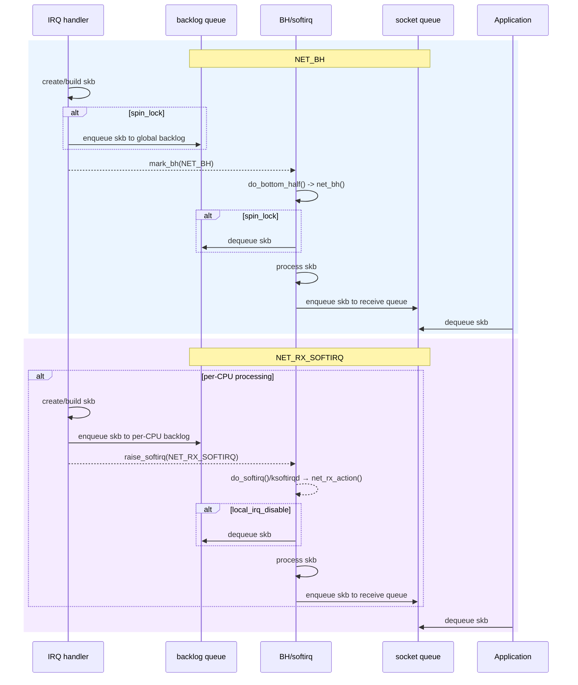

> 이 글에서는 NAPI(New API) 등장 이전의 NET_SOFTIRQ에 대해 다룹니다. NAPI 전후의 NET_RX_SOFTIRQ는 다소 차이가 있습니다.

# SMP support in Linux

NET_BH가 개발되었던 리눅스 1.x 버전은 단일 CPU(uniprocessor)를 전제로 설계되었습니다. 이후 Intel이 MP(Multiprocessor) specification을 발표하였고, 이를 지원하기 위해 리눅스 2.0부터 SMP(Symmetric Multi-Processing)가 도입되었습니다.
[Linux Version 2.0](https://www.linuxjournal.com/article/1311), [SMP.txt](https://elixir.bootlin.com/linux/2.0/source/Documentation/SMP.txt)

SMP가 도입되면서 top-half와 bottom-half를 처리할 코어가 다를 수 있게 되었고, 여러 코어에서 한 자원(backlog 큐)를 접근하는 것을 보호하기 위해 리눅스 2.1.91부터 **락**이 도입되었습니다.


# softirq adoption for improved scalability

`top/bottom half`는 SMP 지원 이전에 설계되었기 때문에 멀티코어 환경은 고려되지 않았습니다. 이후 리눅스가 SMP를 지원하면서, `top/bottom half`는 bottom half가 어느 코어에서든 실행될 수 있지만 동시에 하나의 코어에서만 실행되도록 변경되었습니다. 이러한 구조때문에 CPU 코어 개수에 따른 확장성(scalability)가 제한되었습니다.

이를 해결하기 위해 softnet은 `top/bottom half`를 softirq로 대체하였습니다. [(참고)](https://mirror.linux.org.au/pub/linux.conf.au/2003/papers/Matthew_Wilcox/Matthew_Wilcox.pdf) softirq는 각 CPU 코어 별로 독립적으로 관리/실행되므로 CPU 코어 수만큼 병렬 처리가 가능합니다. 이 패치는 리눅스 2.3.43에 머지되었습니다.

병렬 처리 효과를 높이기위해 backlog 큐를 CPU 코어별로 생성하고, softirq를 인터럽트 핸들러를 처리한 코어에서 실행하도록 하였습니다. 그리고 softirq에서 큐를 접근할 때 인터럽트를 꺼서 인터럽트와 softirq간 큐 접근에 의한 락을 제거하였습니다.

# How NET_RX_SOFTIRQ(before NAPI) works

NET_RX_SOFTIRQ를 NET_BH와 비교하면 다음과 같습니다.



주요 차이점은 다음과 같습니다.

| **Step**                | **NET_BH**              | **NET_RX_SOFTIRQ**                        |
|-------------------------|-------------------------|-------------------------------------------|
| **IRQ handler enqueue** | Global backlog queue    | Per-CPU backlog queue                     |
| **BH/softirq**          | Runs on a single core   | Runs in parallel on multiple cores        |
| **backlog queue access**| Accessed with spin_lock | Accessed with local_irq_disable (no lock) |

<details>
<summary>소스 코드와 함께 보기</summary>

인터럽트 핸들러(top-half)는 다음과 같이 동작합니다.

```c
irqreturn_t irq_handler(int irq, void *ctx, ...)
{
    while(true) {
        skb = build_skb_from_ctx(ctx);
        if (skb == NULL)
            break;

        netif_rx(skb);
    }
}

void netif_rx(struct sk_buff *skb)
{
	struct softnet_data *queue = &softnet_data[smp_processor_id()];

    if (queue->input_pkt_queue.qlen <= netdev_max_backlog) {
        __skb_queue_tail(&queue->input_pkt_queue, skb);
        __cpu_raise_softirq(this_cpu, NET_RX_SOFTIRQ);
        return;
    }

    kfree_skb(skb);
    return;
}
```

NET_RX_SOFTIRQ(bottom-half)는 다음과 같이 동작합니다.

```c
void net_rx_action(struct softirq_action *h)
{
	struct softnet_data *queue = &softnet_data[smp_processor_id()];
    
	for (;;) {
		struct sk_buff *skb;

		local_irq_disable();
		skb = __skb_dequeue(&queue->input_pkt_queue);
		local_irq_enable();
        
		if (skb == NULL)
			break;

        process_skb(skb);
}
```
</details>


# Introduction of execution time limits

softirq는 다음의 시점에 실행됩니다.

1. 인터럽트 핸들러가 종료될 때
2. `schedule()` 함수가 실행될 때

softirq의 실행 빈도는 주변 장치 동작(인터럽트 핸들러의 실행 시점과 빈도)과 프로세스가 호출하는 시스템 콜(`schedule()` 호출 빈도)에 따라 달라집니다. 이로 인해 프로세스는 매우 긴 시간 지연될 수 있습니다.

이 때문에 `NET_RX_SOFTIRQ`에 실행 시간 제한이 도입된 것으로 보입니다. 그러나 이 제한이 softirq의 실행 횟수를 줄이지는 않기 때문에, softirq가 자주 발생하는 환경에서는 지연 시간 제한 효과가 크지 않았을 것으로 보입니다.


# Introduction of `ksoftirqd`

위와 반대로, 실행 환경(주변 장치, 프로세스의 시스템 콜 사용)에 따라 softirq가 긴 시간 지연되어 실행될 수 있습니다. softirq는 인터럽트 핸들러에 비해 덜 긴급한 일을 수행할 뿐 빠른 시간내에 실행되어야 합니다. [참고: lwn.net](https://lwn.net/2001/0726/kernel.php3)

이 문제를 해결하기 위해(다른 이유도 있습니다만), 리눅스 2.4.7에 `ksoftirqd`가 추가되었습니다. `ksoftirqd`는 각 CPU 코어마다 존재하는 쓰레드로, 스케줄러에 의해 관리됩니다. 이 쓰레드는 softirq의 실행이 지연될 경우 softirq의 역할을 쓰레드 컨텍스트에서 수행합니다.
