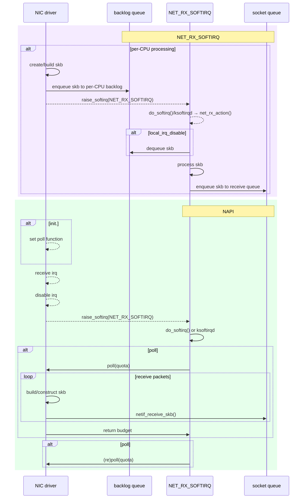

# softnet

1996년, 리눅스는 멀티프로세서를 지원하기 위해 2.0에 SMP를 추가하였습니다. 이후 1999년, [Mindcraft](http://mindcraft.com/)는 NT와 리눅스를 비교한 [벤치마크](https://www.kegel.com/nt-linux-benchmarks.html)를 공개했습니다. 이 벤치마트를 통해 리눅스의 scalability에 문제가 있음이 확인되었습니다. 이를 개선하기 위해 개발자 버전인 2.3.43에 추가된 패치가 softnet입니다. (공식 버전 기준으로는 2.4버전부터 지원됩니다.) NET_RX_SOFTIRQ는 softnet 패치의 일부로 보입니다.

# *Beyond Softnet*

softnet이 추가되었음에도 불구하고, 몇 가지 문제점이 남아 있었습니다. 이를 개선하기 위해 NAPI(New API) 메커니즘이 도입되었고, 이 메커니즘이 어떤 문제를 어떻게 해결했는지 설명한 논문이 *Beyond Softnet*입니다.

# Problems

## Congestion collapse

softnet이 패킷 수신 절차를 top-half와 bottom-half로 나누고, bottom-half를 지연 처리할 수 있도록 하여 하드웨어 인터럽트 처리 시간을 줄였습니다. 하지만 수신 패킷량이 증가하면 결국 top-half 처리에 CPU를 모두 소모하게 됩니다. 그러면 시스템은 패킷을 계속 수신하지만, 결국 모두 버리게 되는 interrupt livelock에 빠지게 됩니다.

## Limitation of mitigation solutions

시스템이 네트워크 혼잡으로 인해 붕괴되는 것을 방지하기 위해, 몇 가지 하드웨어 기반 솔루션이 도입되었습니다.

### HFC(Hardware Flow Control)

HFC는 일부 이더넷 장치에서 제공했던 기술로, backlog queue가 가득 차면 드라이버가 이를 하드웨어에 알리고, 하드웨어는 backlog queue가 bottom-half를 통해 비워질 때까지 인터럽트를 보내지 않고 하드웨어에서 패킷을 드랍하는(*early drop*) 기술입니다.

### FF(Fast Feedback? Fast Forwarding?)

FF는 HFC보다 발전된 기법으로, 드라이버가 backlog queue가 가득 차기 전에 backlog queue가 채워지는 속도를 보고 혼잡을 탐지하여, 이를 미리 하드웨어에 알리는 기술입니다.

### Limitations

이 솔루션들은 두 가지 한계점을 가지고 있습니다.
- 일부 NIC에서만 지원됨
- NIC의 개수가 증가하면 각 NIC의 혼잡 제어만으로 시스템 전체의 혼잡 붕괴를 방지할 수 없음

## Greedy interfaces

backlog queue는 코어마다 존재하고, 각 NIC 인터페이스는 이 backlog queue를 채웁니다. 만약 특정 인터페이스의 수신 속도가 증가하여 backlog queue가 가득 차게 되면, 다른 인터페이스는 backlog queue를 채울 기회를 잃게 됩니다.

FF는 이를 방지하기 위해 라우터 등에서 사용하는 RED(Random Early Drop) 기법을 도입하였고, 어느 정도 효과를 보였으나 일부 환경에서 문제를 발생시켰습니다.

## Packet re−ordering

NIC은 패킷을 CPU 메모리로 DMA한 후 인터럽트를 발생시킵니다. CPU는 인터럽트 핸들러를 실행하여 DMA된 패킷을 backlog queue에 넣습니다. 이때 *인터럽트 핸들러*가 실행하는 CPU 코어가 하나가 아니라면 어떤 일이 일어날까요?

예를 들어, 패킷 A의 인터럽트 핸들러를 0번 코어가 실행하고, 직후에 수신된 패킷 B의 인터럽트 핸들러를 1번 코어가 실행한 경우를 생각해봅시다. 패킷 A는 0번 backlog queue에, 패킷 B는 1번 backlog queue에 각각 보관됩니다. 이후 각 코어의 NET_RX_SOFTIRQ가 실행 각 패킷을 처리하게 될겁니다. softirq는 *지연 실행* 될 수 있으므로 각 코어의 NET_RX_SOFTIRQ는 호출 순서에 맞춰 실행되지 않을 수 있습니다. 이 경우 패킷 순서 뒤바뀜이 발생하게 됩니다.

# NAPI(New API)

softnet을 개선하는 과정에서 패킷 수신 매커니즘을 변경한 API가 개발되었습니다. 이 매커니즘을 NAPI라 부릅니다. NAPI는 2.4.7에서 처음 테스트되었고(이 논문 시점), 이후 개발자 버전인 2.5에서 계속 개발되다가 2.4.20으로 backport되었고, 이후 2.6부터 표준 패킷 수신 메커니즘으로 자리 잡게 됩니다.. ([ref](https://studylib.net/doc/7783820/a-map-of-the-networking-code-in-linux-kernel-2.4.20))

## How NAPI works

## Design goals

NAPI 개발에는 7가지 다자인 목표가 있었습니다.

1. Maintain the parallellization and scaling benefits of softnet
2. Remove packet re−ordering in SMP.
3. Reduce interrupts on overload to allow the system to peak to a flat curve at MLFFR.
4. Drop Early on overload.
5. Remove or reduce the unfairness issues
6. Balance between latency and throughput.
7. Should not be dependent on any hardware specifics

NAPI가 이 목표를 어떻게 달성했는 지 보겠습니다.(일부만)

## Remove packet re−ordering in SMP

패킷 순서 뒤바뀜 문제를 해결하는 방법은 아주 간단합니다. NIC의 패킷 수신 인터럽트를 담당하는 코어를 하나로 지정(irq affinity)하면 됩니다.

SMP는 Intel의 [*MultiProcessor Specification*](https://www.cs.utexas.edu/~dahlin/Classes/439/ref/ia32/MPspec.pdf)를 지원하기 위해 개발되었으며([ref](https://www.linuxjournal.com/article/1311)), 이 표준에는 인터럽트를 처리할 코어를 지정할 수 있는 *APIC redirection table*이 정의되어 있습니다. 리눅스는 2.3.58에 해당 테이블을 제어하기 시작했고, 사용자는 *procfs*를 통해 이를 제어할 수 있게 되었습니다. 현재는 대부분의 이더넷 드라이버가 초기화 시 irq affinity를 설정해 줍니다.

## Drop Early on overload

초창기(v1.0 전후)나 softnet에서 congestion collapse(또는 interrupt livelock)가 발생하는 이유는, 드라이버가 커널이 처리할 수 없는 양의 트래픽을 커널로 전달하려 하기 때문입니다. 매우 높은 트래픽에서는 커널은 패킷을 처리할 시간이 없어지기도 합니다.

이를 해결하기 위해 NAPI는 패킷 수신 모델을 변경합니다. 드라이버가 패킷을 push하는 방식이 아니라, 커널이 드라이버를 poll하는 방식으로 전환하였습니다.

이를 통해 커널은 NIC으로부터 가져올 패킷의 개수를 직접 제어할 수 있게 되었고, 커널이 처리할 수 없는 상황에서는 NIC의 DMA ring이 가득 차도록 하여 패킷이 NIC 레벨에서 드랍되도록 유도합니다. 즉, 처리 한도를 넘어선 패킷은 패킷 구성조차 하지 않도록 하여 overload 상황에서의 붕괴를 막습니다.

## Remove or reduce the unfairness issues

softnet 구조에서는 특정 인터페이스의 인터럽트 핸들러가 backlog queue를 가득 채워버리면, 다른 인터페이스는 패킷을 커널로 전달할 기회를 잃게 되는 문제가 있었습니다.

NAPI에서는 드라이버의 poll 함수가 한 번에 커널로 전달할 수 있는 패킷의 최대 개수를 제한함으로써, 각 인터페이스가 사용하는 처리 자원을 보다 공정하게 분배하도록 설계되었습니다. 이를 통해 greedy interface로 인한 불균형 문제를 완화할 수 있습니다.

# Beyond *Beyond Softnet*: NAPI rework

NAPI가 리눅스에 병합된 이후, 2.6.24에서 한 차례 구조적인 개선 작업이 이루어집니다.

## multiple NAPI instance

초기 NAPI에서는 NAPI 정보가 `net_device` 구조체에 포함되어 있었기 때문에, 하나의 네트워크 인터페이스는 하나의 NAPI instance만을 가질 수 있었습니다.

NIC이 multi receive queue를 지원하게 되면서, 하나의 인터페이스가 여러 개의 NAPI instance를 가질 수 있도록 `napi_struct` 구조체가 `net_device`에서 분리되었습니

## Enhanced NAPI control

초기 NAPI에서는 드라이버의 poll 콜백 함수가 패킷을 수신했음을 알리면, 커널은 반드시 한 번 더 폴링을 수행했습니다.

불필요한 폴링을 제거하기 위해, 드라이버가 더 이상 수신할 패킷이 없음을 알릴 수 있는 API가 추가되었고, 커널이 드라이버의 수신량을 제어하는 데 사용되던 `quota` 변수는 제거되었습니다.

https://lwn.net/Articles/214457/
https://lwn.net/Articles/244640/
