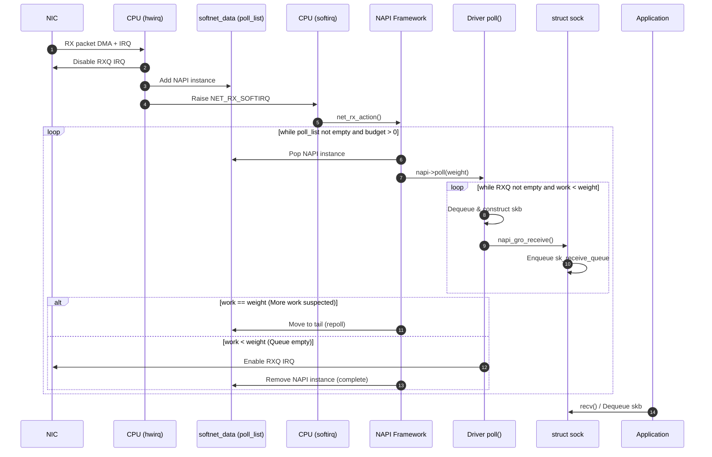

> Eric Dumazet이 Netdev 2.1(2017)에서 발표한 [BUSY POLLING](https://netdevconf.info/2.1/slides/apr6/dumazet-BUSY-POLLING-Netdev-2.1.pdf)과 [Busy Polling: Past, Present, Future](https://netdevconf.org/2.1/papers/BusyPollingNextGen.pdf)는 리눅스 4.x까지의 busy poll을 잘 설명하고 있습니다. 이 글에서는 해당 슬라이드를 기반으로, 리눅스 5.11에 추가된 preferred busy poll까지 다뤄보겠습니다.


# The NAPI rework as baseline

2008년 리눅스 2.6.24에 `NAPI rework` 패치가 적용된 이후, NAPI의 기본 동작 구조는 큰 틀에서 변하지 않았습니다. 이 rework 직후의 구조를 baseline으로 설정하여, 이후 추가된 기능들을 차례로 설명해 보겠습니다.


## Driver initialization

다음은 일반적인 이더넷 드라이버 초기화 과정입니다.

```c
irq_handler_t nic_rxq_irq_handler;
int nic_napi_poll(struct napi_struct *napi, int budget);

int nic_netdev_init(struct net_device *netdev)
{
    struct nic *nic = netdev_priv(netdev);

    ...

    for(i = 0; i < nic->num_rx_queues; i++) {
        struct nic_rxq *rxq = nic_rxq(i);

        netif_napi_add(netdev, &rxq->napi, nic_napi_poll, NAPI_POLL_WEIGHT);
        request_irq(rxq->irq_vec, nic_rxq_irq_handler, ..., rxq);
    }
}
```

드라이버는 초기화 시 수신 큐(RX Queue)마다 하나의 NAPI 인스턴스를 생성하고, 각 큐에 대응하는 인터럽트 벡터를 커널에 등록합니다.


## Interrupt handling(hwirq context)

NIC은 패킷을 CPU 메모리로 DMA한 후 인터럽트를 발생시킵니다. 인터럽트가 발생하면 NIC의 인터럽트 핸들러가 실행됩니다.

NIC은 패킷을 CPU 메모리로 DMA(Direct Memory Access)한 후 인터럽트를 발생시킵니다. 해당 인터럽트 affinity에 따라 지정된 CPU가 NIC의 인터럽트 핸들러를 실행합니다.

```c
irqreturn_t nic_rxq_irq_handler(int irq, void *data)
{
    struct nic_rxq *rxq = data;

    nic_irq_disable(rxq);

    napi_schedule(&rxq->napi);

    return IRQ_HANDLED;
}
```

인터럽트 핸들러는 과도한 인터럽트 발생을 막기 위해 수신 큐의 인터럽트를 비활성화하고(`Beyond Softnet` 참조), `napi_schedule()`을 통해 NAPI 폴링을 요청합니다.

```c
void napi_schedule(struct napi_struct *napi)
{
    struct list_head *sd_poll_list = &this_cpu_ptr(&softnet_data)->poll_list;

	local_irq_save(flags);
	list_add_tail(&napi->poll_list, sd_poll_list);
	__raise_softirq_irqoff(NET_RX_SOFTIRQ);
	local_irq_restore(flags);
}
```

`napi_schedule()`은 현재 CPU 코어의 `softnet_data.poll_list`에 해당 NAPI 인스턴스를 추가한 뒤, `NET_RX_SOFTIRQ` softirq를 발생시킵니다.


## NAPI(softirq context)

`NET_RX_SOFTIRQ` softirq가 실행되면 해당 softirq의 핸들러인 `net_rx_action()`이 실행됩니다.

```c
void net_rx_action(void)
{
    struct list_head *sd_poll_list = &this_cpu_ptr(&softnet_data)->poll_list;
    int budget = netdev_budget;

    while (!list_empty(sd_poll_list)) {
        if (budget == 0)
            break;

        local_irq_disable();
        napi = list_first_entry(sd_poll_list, struct napi_struct, poll_list);
        local_irq_enable();

        weight = min(napi->weight, budget);
        work = napi->poll(napi, weight);
        budget -= work;
        
        local_irq_disable();
        if (work == weight)
            list_move_tail(&napi->poll_list, sd_poll_list);
        local_irq_enable();
    }
}
```

간단한 코드이지만 나눠서 보겠습니다.

```c
    int budget = netdev_budget;
```

전역 변수인 `netdev_budget`(기본값 300)을 읽어옵니다. 이는 한 번의 softirq 호출에서 처리할 수 있는 최대 패킷 수이며, sysctl을 통해 조정 가능합니다.

```c
    while (!list_empty(sd_poll_list)) {
        if (budget == 0)
            break;
```

CPU 코어의 `softnet_data.poll_list`가 비어 있거나(NAPI를 호출한 인스턴스가 없는 경우) `budget`을 모두 소모할 때까지 반복합니다.

```c
        local_irq_disable();
        napi = list_first_entry(sd_poll_list, struct napi_struct, poll_list);
        local_irq_enable();
```

`softnet_data.poll_list`에 NAPI 인스턴스를 가져옵니다. `poll_list`는 인터럽트 핸들러(hwirq)와 공유되는 리스트이므로, local_irq_disable()로 원자성을 보장하며 인스턴스를 가져옵니다.

```c
        weight = min(napi->weight, budget);
        work = napi->poll(napi, weight);
        budget -= work;
```

NAPI 인스턴스의 poll 콜백 함수를 호출합니다. 이때 인자로 전달되는 weight는 해당 드라이버가 희망하는 최대 처리량(`napi->weight`)과 남은 budget 중 최솟값입니다.

```c
        local_irq_disable();
        if (work == weight)
            list_move_tail(&napi->poll_list, sd_poll_list);
        local_irq_enable();
```

`poll` 콜백 함수가 주어진 weight를 모두 소모했다면, 드라이버가 더 처리할 패킷이 있을 가능성이 있으므로 NAPI 인스턴스를 `softnet_data.poll_list`의 마지막으로 옮깁니다(*repoll*).

## driver NAPI `poll` function

드라이버의 NAPI `poll` 콜백 함수는 일반적으로 다음과 같이 동작합니다.

```c
int __nic_napi_poll(struct nic_rxq *rxq, int budget)
{
    int done = 0;

    for(i = 0; i < budget; i++) {
        struct skb_buff *skb = nic_rxq_get_skb(rxq);
        if (skb == NULL)
            break;

        napi_gro_receive(&rxq->napi, skb);
        done++;
    }

    if (!nic_rxq_recv_more(rxq)) {
        napi_complete(napi);
        nic_rxq_enable_irq(rxq);
    }

    return done;
}

int nic_napi_poll(struct napi_struct *napi, int budget)
{
    struct nic_rxq *rxq = napi_to_rxq(napi);

    return __nic_napi_poll(rxq, budget);
}
```

역시 간단한 코드이지만 나눠서 보겠습니다.

```c
    for(i = 0; i < budget; i++) {
        struct skb_buff *skb = nic_get_skb(rxq);
        if (skb == NULL)
            break;
```

최대 `budget`만큼의 수신큐에서 패킷을 꺼내 `skb`를 구성합니다.

```c
        napi_gro_receive(&rxq->napi, skb);
        work++;
```

수신 큐로부터 구성된 패킷 skb를 `napi_gro_receive()`를 통해 커널로 전달합니다.

> 리눅스 2.6.29에 GRO(Generic Receive Offload)가 추가된 후 대부분의 드라이버가 GRO API인 `napi_gro_receive()`를 통해 패킷(skb)을 커널로 전달합니다. 이 외에도 `netif_rx()`, `netif_receive_skb()` API가 있으나 잘 사용되지 않습니다.

```c
    if (!nic_rxq_rcv_more(skb)) {
        napi_complete(napi);
        nic_rxq_enable_irq(rxq);
    }
```

더 처리할 패킷이 없다면 `napi_complete()`를 호출하여 NAPI 인스턴스를 폴링 리스트에서 제외하고, 큐의 인터럽트를 다시 활성화합니다. 이 과정을 통해 *repoll*이 보장되는 기간동안 NIC은 인터럽트를 발생시킬 필요가 없게 됩니다.

`napi_gro_receive()`를 통해 전달된 skb는 네트워크 스택을 거쳐 다시 외부로 나가거나(forwarding 등) 소켓의 `sk_receive_queue` 또는 `sk_backlog`에 보관됩니다. (`sk_backlog`는 소켓이 락이 걸려 있는 경우 임시로 패킷을 보관하는 용도로 사용됩니다.)

```c
static int __must_check tcp_queue_rcv(struct sock *sk, struct sk_buff *skb, int hdrlen,
		  bool *fragstolen)
{
    ...
	eaten = (tail && tcp_try_coalesce(sk, tail, skb, fragstolen)) ? 1 : 0;
	if (!eaten) {
		__skb_queue_tail(&sk->sk_receive_queue, skb);
    }
}

int tcp_rcv_established(struct sock *sk, struct sk_buff *skb,
			const struct tcphdr *th, unsigned int len)
{
    ...
    eaten = tcp_queue_rcv(sk, skb, tcp_header_len,
                    &fragstolen);
    ...
	tcp_data_queue(sk, skb);
    ...
}

int tcp_v4_do_rcv(struct sock *sk, struct sk_buff *skb)
{
    ...
	if (sk->sk_state == TCP_ESTABLISHED) { /* Fast path */
		if (tcp_rcv_established(sk, skb, tcp_hdr(skb), skb->len)) {
    ...
}

int tcp_v4_rcv(struct sk_buff *skb)
{
    ...
	if (!sock_owned_by_user(sk)) {
        if (!tcp_prequeue(sk, skb))
            ret = tcp_v4_do_rcv(sk, skb);
	} else if (unlikely(sk_add_backlog(sk, skb, sk->sk_rcvbuf + sk->sk_sndbuf))) {
    ...
}
```

```c
int sock_queue_rcv_skb(struct sock *sk, struct sk_buff *skb)
{
	struct sk_buff_head *list = &sk->sk_receive_queue;
    ...
	__skb_queue_tail(list, skb);
}

static int __udp_queue_rcv_skb(struct sock *sk, struct sk_buff *skb)
{
    ...
	rc = sock_queue_rcv_skb(sk, skb);
    ...
}

int udp_queue_rcv_skb(struct sock *sk, struct sk_buff *skb)
{
    ...
	if (!sock_owned_by_user(sk))
	    rc = __udp_queue_rcv_skb(sk, skb);
	else if (sk_add_backlog(sk, skb, sk->sk_rcvbuf)) {
    ...
}

int __udp4_lib_rcv(struct sk_buff *skb, struct udp_table *udptable,
		   int proto)
{
    ...
	sk = __udp4_lib_lookup_skb(skb, uh->source, uh->dest, udptable);

	if (sk != NULL) {
		ret = udp_queue_rcv_skb(sk, skb);
        ...
}
```

이후 어플리케이션은 recv() 등의 시스템콜을 통해 데이터를 가져갑니다.

이 과정을 시퀀스 다이어그램으로 표현하면 다음과 같습니다.



### Avoiding unnecessary NAPI repoll

우연히 NAPI가 지정한 `budget`만큼의 패킷이 수신되었다면 어떤 일이 일어날까요? 드라이버는 모든 패킷을 처리했으니 `napi_complete` API를 호출하고 NAPI 폴링을 중단하고자 할 것입니다. 하지만 NAPI는 드라이버가 주어진 `budget`을 다 사용했으니 더 처리할 패킷이 있을 가능성이 높다 판단하고 `repoll`하려 할것입니다. 그러면 드라이버는 불필요한 폴링을 한 번 더 수행하게 되죠.

이를 방지하기 위해, 많은 드라이버는 다음의 트릭을 사용합니다.

```c

int __nic_napi_poll(struct nic_rxq *rxq, int budget)
{
	...

    if (!nic_rxq_recv_more(rxq)) {
        napi_complete(napi);
        nic_rxq_enable_irq(rxq);

+		if (done == budget)
+			done--;
    }

    return done;
}
```

더 처리할 패킷이 없고, `done`과 `budget`이 같다면, `done - 1`을 반환해 NAPI가 `repoll`하지 않도록 합니다.
