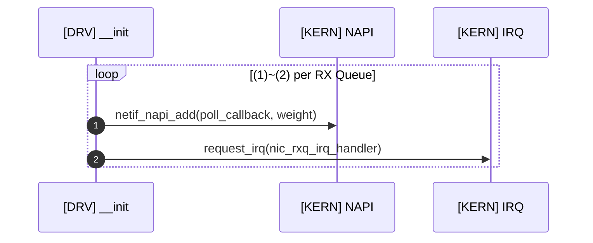
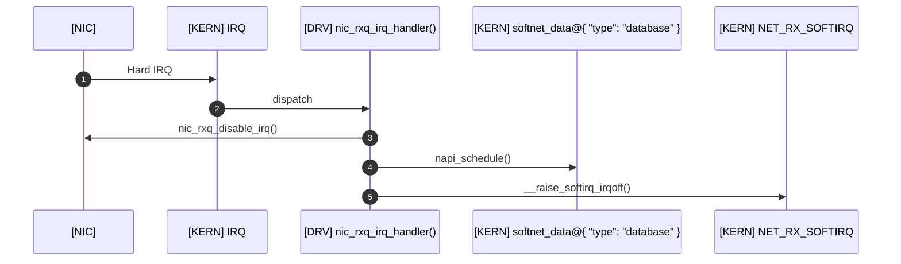
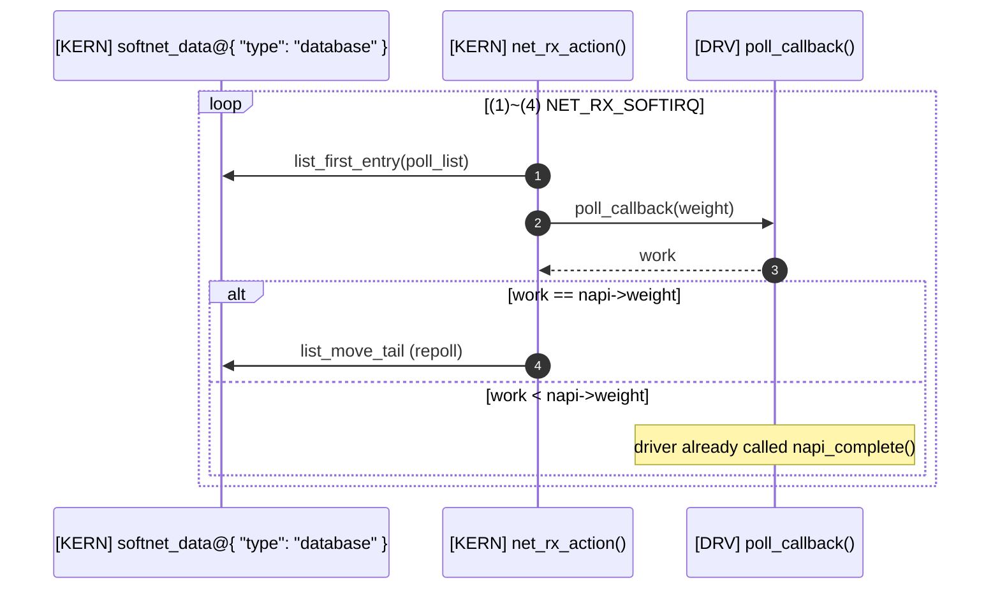
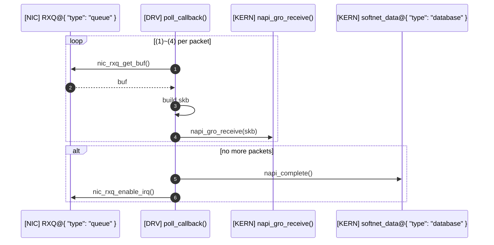
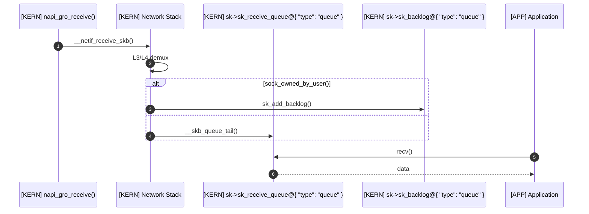
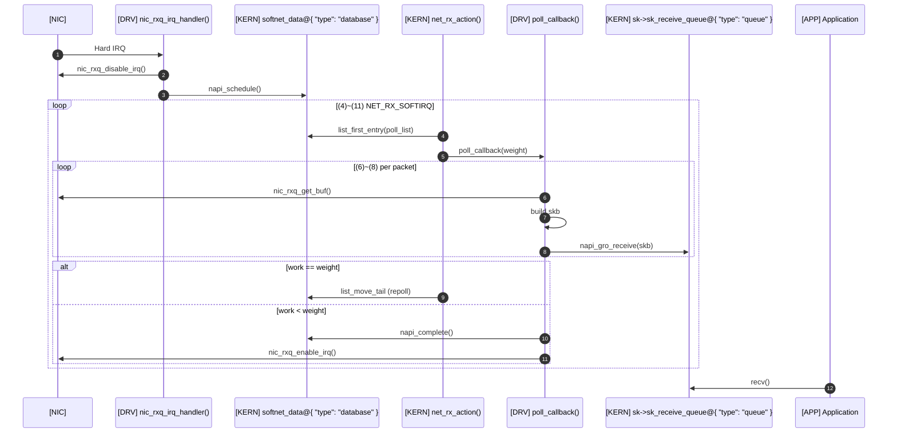

> Eric Dumazet이 Netdev 2.1(2017)에서 발표한 [BUSY POLLING](https://netdevconf.info/2.1/slides/apr6/dumazet-BUSY-POLLING-Netdev-2.1.pdf)과 [Busy Polling: Past, Present, Future](https://netdevconf.org/2.1/papers/BusyPollingNextGen.pdf)는 리눅스 4.x까지의 busy poll을 잘 설명하고 있습니다. 이 글에서는 해당 슬라이드를 기반으로, 리눅스 5.11에 추가된 preferred busy poll까지 다뤄보겠습니다.


# The NAPI rework as baseline

2008년 리눅스 2.6.24에 `NAPI rework` 패치가 적용된 이후, NAPI의 기본 동작 구조는 큰 틀에서 변하지 않았습니다. 이 rework 직후의 구조를 baseline으로 설정하여, 이후 추가된 기능들을 차례로 설명해 보겠습니다.


## Driver initialization

드라이버는 초기화 시 수신 큐(RX Queue)마다 NAPI 인스턴스와 인터럽트 핸들러를 등록합니다.



> **loop (1)~(2) per RX Queue**: 모든 수신 큐(RX Queue)를 순회하면 종료

1. 드라이버가 `netif_napi_add()`를 호출해 `poll()` 콜백 함수와 함께 NAPI 인스턴스를 등록.
2. 드라이버가 `request_irq()`를 호출해 인터럽트 핸들러(`nic_rxq_irq_handler()`)를 커널에 등록.


## Interrupt handling(hwirq context)

NIC이 패킷을 시스템 메모리로 DMA한 후 인터럽트를 발생시키면, 인터럽트 핸들러가 추가 인터럽트를 비활성화하고 NAPI 폴링을 요청합니다.



1. NIC이 패킷을 시스템 메모리로 DMA한 후 인터럽트를 발생시킴.
2. 커널이 인터럽트 핸들러(`nic_rxq_irq_handler()`)를 호출.
3. 인터럽트 핸들러가 `nic_rxq_disable_irq()`로 수신 큐의 인터럽트를 비활성화(`Beyond Softnet` 참조).
4. 인터럽트 핸들러가 `napi_schedule()`을 호출해 NAPI 인스턴스를 현재 CPU의 `softnet_data.poll_list`에 추가.
5. `napi_schedule()` 내부에서 `__raise_softirq_irqoff()`로 `NET_RX_SOFTIRQ`를 발생시킴.


## NAPI(softirq context)

`NET_RX_SOFTIRQ`가 실행되면, `softnet_data`의 `poll_list`에서 NAPI 인스턴스를 꺼내 드라이버의 `poll()` 콜백 함수를 호출합니다.



> **loop (1)~(4) NET_RX_SOFTIRQ**: 다음 중 하나를 만족하면 종료
> - `softnet_data.poll_list`가 빈 경우
> - `budget`(`netdev_budget`, 기본값 300)을 소모한 경우
> - 시간 제한(2 jiffies)에 도달한 경우

1. `NET_RX_SOFTIRQ`의 핸들러인 `net_rx_action()`이 `softnet_data.poll_list`에서 NAPI 인스턴스를 가져옴.
2. `napi->weight`와 남은 `budget` 중 최솟값을 `weight`로 전달하며 `poll()` 콜백 함수를 호출.
3. `poll()` 콜백 함수가 처리한 패킷 수(`work`)를 반환.
4. `work`가 `weight`와 같으면 처리할 패킷이 더 있을 수 있으므로, NAPI 인스턴스를 `poll_list` 마지막으로 옮겨 다시 폴링(*repoll*).
      - `work`가 `weight`보다 작은 경우는 아래 *Driver NAPI poll callback* 섹션의 과정을 통해 처리됨.


## Driver NAPI poll callback

드라이버의 `poll()` 콜백 함수는 수신 큐에서 패킷을 꺼내 커널로 전달하고, 더 이상 처리할 패킷이 없으면 NAPI를 완료하고 인터럽트를 재활성화합니다.



> **loop (1)~(4) per packet**: 다음 중 하나를 만족하면 종료
> - `budget`를 모두 소모한 경우
> - 수신 큐가 빈 경우

1. 드라이버가 `nic_rxq_get_buf()`를 호출해 수신 큐에서 수신 버퍼를 가져옴.
2. 수신 큐가 버퍼를 반환.
3. 드라이버가 버퍼를 `skb`로 변환.
4. 드라이버가 `napi_gro_receive()`를 호출해 `skb`를 커널로 전달.
5. 더 처리할 패킷이 없으면, 드라이버가 `napi_complete()`를 호출해 NAPI 인스턴스를 `poll_list`에서 제거.
6. 드라이버가 `nic_rxq_enable_irq()`로 수신 큐의 인터럽트를 재활성화. *repoll*이 보장되는 기간 동안 NIC은 인터럽트를 발생시킬 필요가 없음.

> 리눅스 2.6.29에 GRO(Generic Receive Offload)가 추가된 이후, 대부분의 드라이버가 GRO API인 `napi_gro_receive()`를 통해 패킷(`skb`)을 커널로 전달합니다. 이 외에도 `netif_rx()`, `netif_receive_skb()` API가 있으나 잘 사용되지 않습니다.

`skb`는 네트워크 스택을 거쳐 소켓의 수신 큐 또는 백로그에 적재되고, 어플리케이션이 시스템콜을 통해 데이터를 가져갑니다.



1. `napi_gro_receive()`가 `__netif_receive_skb()`를 통해 `skb`를 네트워크 스택으로 전달.
2. L3/L4 프로토콜 처리 및 소켓 demux를 수행(`ip_rcv()`, `tcp_v4_rcv()` 등).
3. 소켓이 사용 중이면(`sock_owned_by_user()`) `sk_add_backlog()`로 백로그에 임시 보관. 그렇지 않으면 `__skb_queue_tail()`로 `sk->sk_receive_queue`에 직접 적재.
4. 어플리케이션이 `recv()`로 `sk->sk_receive_queue`에서 데이터를 가져감.

## End-to-end flow

지금까지 설명한 전체 흐름을 하나의 다이어그램으로 정리하면 다음과 같습니다.



> **loop (4)~(11) NET_RX_SOFTIRQ**: 다음 중 하나를 만족하면 종료
> - `softnet_data.poll_list`가 빈 경우
> - `budget`(`netdev_budget`, 기본값 300)을 소모한 경우
> - 시간 제한(2 jiffies)에 도달한 경우

> **loop (6)~(8) per packet**: 다음 중 하나를 만족하면 종료
> - `work`가 `weight`에 도달한 경우
> - 수신 큐가 빈 경우

### Avoiding unnecessary NAPI repoll

우연히 NAPI(`net_rx_action()`)가 지정한 `budget`만큼의 패킷이 수신되었다면 어떤 일이 일어날까요? 드라이버는 모든 패킷을 처리했으니 `napi_complete()` API를 호출하고 NAPI 폴링을 중단하고자 할 것입니다. 하지만 NAPI는 드라이버가 주어진 `budget`을 다 사용했으니 더 처리할 패킷이 있을 가능성이 높다 판단하고 `repoll`하려 할 것입니다. 그러면 드라이버는 불필요한 폴링을 한 번 더 수행하게 되죠.

이를 방지하기 위해, 많은 드라이버는 다음의 트릭을 사용합니다.

```c

int __nic_napi_poll(struct nic_rxq *rxq, int budget)
{
	...

    if (!nic_rxq_recv_more(rxq)) {
        napi_complete(napi);
        nic_rxq_enable_irq(rxq);

+		if (done == budget)
+			done--;
    }

    return done;
}
```

더 처리할 패킷이 없고, `done`과 `budget`이 같다면, `done - 1`을 반환해 NAPI가 `repoll`하지 않도록 합니다.
