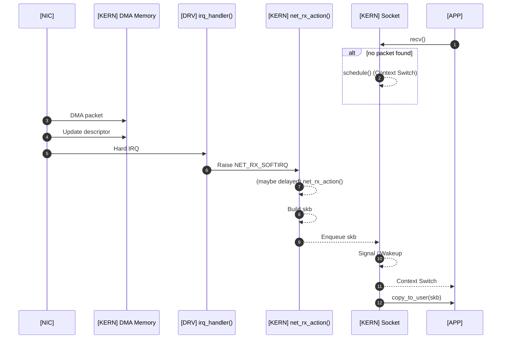
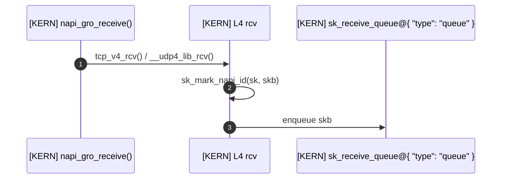
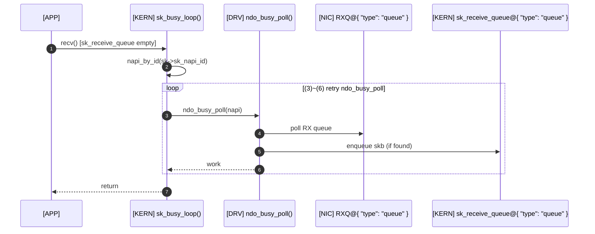
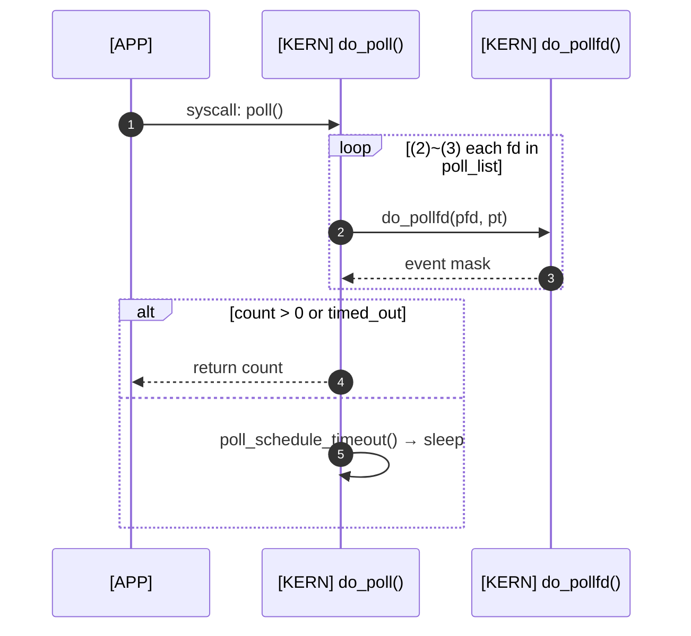
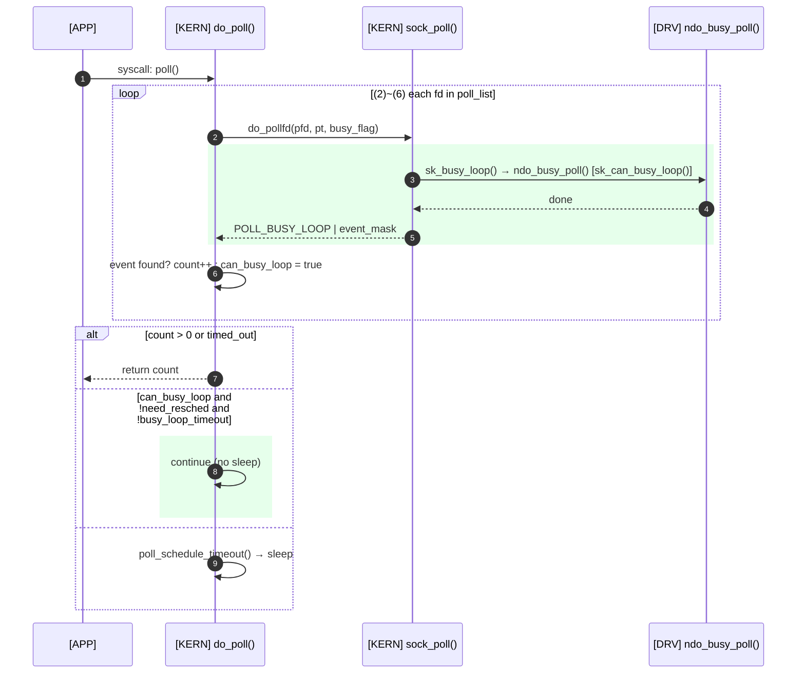

> Eric Dumazet이 Netdev 2.1(2017)에서 발표한 [BUSY POLLING](https://netdevconf.info/2.1/slides/apr6/dumazet-BUSY-POLLING-Netdev-2.1.pdf)과 [Busy Polling: Past, Present, Future](https://netdevconf.org/2.1/papers/BusyPollingNextGen.pdf)는 리눅스 4.x까지의 busy poll을 잘 설명하고 있습니다. 이 글에서는 해당 슬라이드를 기반으로, 리눅스 5.11에 추가된 preferred busy poll까지 다뤄보겠습니다.

# LLS(Low Latency Socket)

2012년, Intel의 *Jesse Brandeburg*는 *Linux Plumbers*에서 네트워크 latency를 줄이기 위한 방법으로 [A way towards Lower Latency and Jitter](https://blog.linuxplumbersconf.org/2012/wp-content/uploads/2012/09/2012-lpc-Low-Latency-Sockets-slides-brandeburg.pdf)를 발표합니다. 내용을 간단하게만 살펴보겠습니다.

유저 프로세스가 패킷이 도착하기 전에 `recv()` 시스템콜을 호출했을 때를 시퀀스 다이어그램으로 표현하면 다음과 같습니다.

[관련 기사](https://lwn.net/Articles/551284/)

소켓에 `O_NONBLOCK` 플래그가 없다면, 패킷이 도착하거나 타임아웃이 발생할 때까지 유저 프로세스는 CPU를 내려놓고 대기(Sleep) 상태로 들어갑니다.

이후 NIC이 패킷을 시스템 메모리로 전달(DMA)하고 인터럽트를 발생시키면, (5) hardirq 발생 (6) hardirq 핸들러 실행 (7) softirq(NAPI) 실행 (8) skb를 구성 (9) skb 큐잉 (10) 프로세스 wakeup 후에야 (12) 소켓으로부터 데이터를 읽어가게 됩니다. 만약 시스템콜에서 직접 NIC을 busy polling 할 수 있다면 (6), (7), (10) 단계를 생략할 수 있습니다.

이 기능은 리눅스 3.11에 머지되면서 공식 명칭이 `Busy Poll`로 변경되었습니다([mail](https://www.spinics.net/lists/kernel/msg1564214.html)). 현재 커널 코드 일부 변수명으로 ll(Low Latency)이라는 키워드가 남아 있는 이유가 바로 이 때문입니다.

# Busy poll: Device polling

앞서 언급한대로, LLS는 `Busy Poll`이란 이름으로 리눅스에 추가되었습니다.

Busy poll은 크게 두 가지로 나눌 수 있습니다.

- `recv`-like syscalls: 소켓에서 데이터를 직접 읽을 때 수행하는 busy polling
- `poll`-like syscalls: 여러 소켓의 이벤트를 대기(`poll()`, `select()`, `epoll()`)할 때 수행하는 busy polling

## `recv`-like syscalls

### Busy poll setup

Busy poll은 전역 설정 또는 소켓별 설정을 통해 활성화할 수 있습니다.

| 설정 방법 | 인터페이스 | 저장 위치 | 적용 범위 |
|-----------|-----------|-----------|-----------|
| 전역 | `/proc/sys/net/core/busy_read` | `sysctl_net_busy_read` → `sk->sk_ll_usec` | 모든 소켓 |
| 소켓별 | `setsockopt(SO_BUSY_POLL)` | `sk->sk_ll_usec` | 해당 소켓 |

### How busy poll runs

패킷이 소켓에 도착할 때 커널은 해당 패킷이 어느 NAPI 인스턴스를 통해 들어왔는지 소켓에 기록합니다.

1. 드라이버의 `poll()` 콜백 함수가 `napi_gro_receive()`를 통해 skb를 네트워크 스택으로 전달. L4 핸들러(`tcp_v4_rcv()`, `__udp4_lib_rcv()`)가 호출됨.
2. L4 핸들러가 `sk_mark_napi_id()`를 호출해 skb가 들어온 NAPI 인스턴스의 ID를 소켓(`sk->sk_napi_id`)에 기록.
3. skb를 `sk->sk_receive_queue`에 적재.

이후 유저 프로세스가 `recv()`를 호출하면, 소켓에 기록된 NAPI ID를 이용해 `sk->sk_receive_queue`가 비어 있으면 해당 NAPI 인스턴스를 직접 폴링합니다.

> **loop (3)~(6) retry ndo_busy_poll**: 다음 중 하나를 만족하면 종료
> - `sk->sk_receive_queue`가 비어 있지 않음
> - `need_resched()`
> - 타임아웃(`sk->sk_ll_usec`) 도달

1. 어플리케이션이 `recv()`를 호출. 커널은 `sk_can_busy_loop()`로 조건(`sk->sk_ll_usec && sk->sk_napi_id && !need_resched() && !signal_pending(current)`)을 확인.
2. `sk->sk_napi_id`로 `napi_by_id()`를 통해 NAPI 인스턴스를 조회. 드라이버가 `ndo_busy_poll()` 콜백을 구현하지 않으면 종료.
3. 드라이버의 `ndo_busy_poll(napi)`를 호출.
4. NIC 수신 큐를 직접 폴링. 공통 코드(`sk_busy_loop()`)는 `rcu_read_lock_bh()`로 NAPI 조회~루프 구간을 보호하고, 드라이버(예: ixgbe)는 자체 상태 플래그로 NAPI softirq 폴링과의 동시 진입을 막는다.
5. 패킷이 있으면 skb를 구성해 `sk->sk_receive_queue`에 적재. 루프 내 `cpu_relax()`로 하이퍼스레딩 환경에서 동일 물리 코어의 다른 논리 코어가 자원을 사용할 수 있게 함.
6. 처리한 패킷 수(work)를 반환. 루프 조건에 따라 반복 또는 종료.
7. 루프 종료 후 결과를 `recv()` 호출부로 반환. `sk->sk_receive_queue`에 데이터가 있으면 이어서 `copy_to_user()`로 복사된다.

## `poll`-like syscalls

### Busy poll setup

`poll()`이나 `select()` 등의 시스템 콜에서도 busy poll을 수행하려면 다음의 설정이 추가되어야 합니다.

| 설정 방법 | 인터페이스 | 저장 위치 |
|-----------|-----------|-----------|
| 전역 | `/proc/sys/net/core/busy_poll` | `sysctl_net_busy_poll` |

### `do_poll()` before `Busy Poll`

`poll()`을 호출하면 fd 목록에 이벤트가 없는 한 슬립과 재폴링을 반복합니다.

> **loop (2)~(3) each fd in poll_list**: `poll_list`의 모든 fd를 순회. 이후 `count > 0` 또는 `timed_out`이면 종료. 아니면 sleep 후 (2)부터 반복.

1. 어플리케이션이 `poll()` 시스템콜을 호출.
2. `poll_list`의 각 fd에 대해 `do_pollfd()`로 이벤트 발생 여부를 확인.
3. 이벤트 마스크를 반환. 이벤트가 발생한 fd는 `count`를 증가시킴.
4. `count > 0` 또는 타임아웃이면 반환. 아니면 `poll_schedule_timeout()`으로 슬립하며 이벤트나 타임아웃을 기다림.

### `do_poll()` after `Busy Poll`

Busy poll이 추가되면 슬립 전에 NAPI 인스턴스를 직접 폴링하는 단계가 삽입됩니다.

> **loop (2)~(6) each fd in poll_list**: `poll_list`의 모든 fd를 순회. 이후:
> - `count > 0` 또는 `timed_out` → 종료
> - `can_busy_loop && !need_resched() && !busy_loop_timeout()` → sleep 없이 (2)부터 반복
> - 그 외 → sleep 후 반복

1. 어플리케이션이 `poll()` 시스템콜을 호출. `net_busy_loop_on()`이면 `busy_flag = POLL_BUSY_LOOP`로 설정.
2. `poll_list`의 각 fd에 대해 `do_pollfd()`를 호출하며 `busy_flag`를 전달.
3. 소켓이 `sk_can_busy_loop()` 조건을 만족하면 `sock_poll()`이 `sk_busy_loop()` → `ndo_busy_poll()`을 호출(내부 절차는 앞서 본 recv 경로의 busy loop와 동일하되, `nonblock=1`이라 재시도 없이 한 번만 수행됨).
4. `ndo_busy_poll()` 결과가 반환됨.
5. `sock_poll()`이 `POLL_BUSY_LOOP | event_mask`를 반환.
6. 이벤트를 찾았으면 `count`를 증가시키고 `busy_flag`를 초기화(busy loop 중단). 이벤트 없이 `POLL_BUSY_LOOP`만 반환됐으면 `can_busy_loop = true`로 설정 — 두 결과는 서로 배타적이다.
7. 모든 fd 순회 후: `count > 0` 또는 타임아웃이면 반환. `can_busy_loop`이 true이고 스케줄링이 필요하지 않으며 타임아웃 전이면 sleep 없이 루프를 반복. 그 외에는 `poll_schedule_timeout()`으로 슬립.

정리하자면, busy poll이 설정되어 있으면 `poll()` 류의 시스템콜은 소켓당 `ndo_busy_poll()`을 1회씩 호출하며, `sysctl_net_busy_poll` 시간까지 반복합니다.
