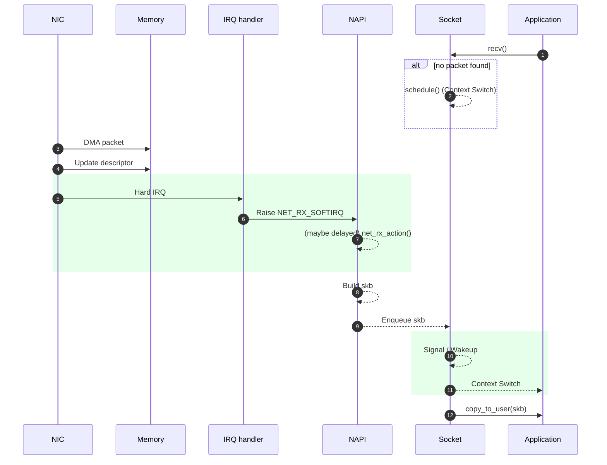
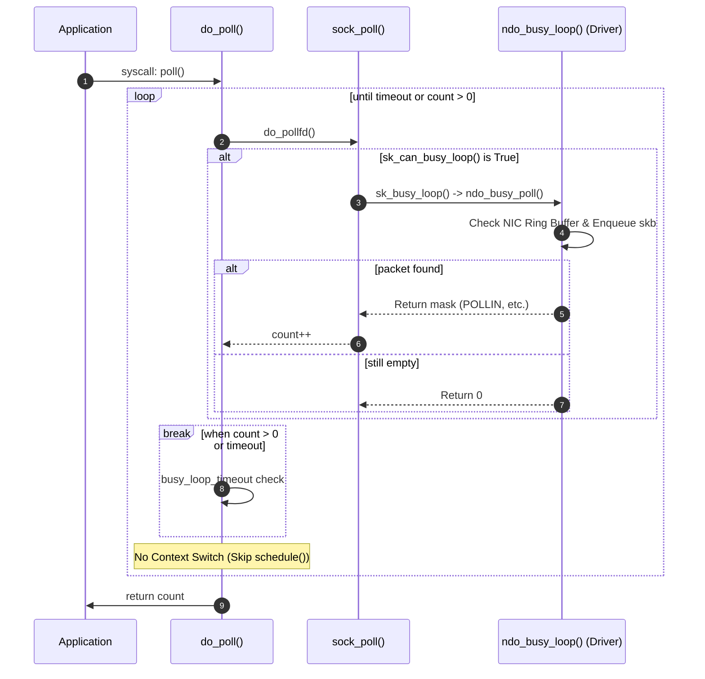

> Eric Dumazet이 Netdev 2.1(2017)에서 발표한 [BUSY POLLING](https://netdevconf.info/2.1/slides/apr6/dumazet-BUSY-POLLING-Netdev-2.1.pdf)과 [Busy Polling: Past, Present, Future](https://netdevconf.org/2.1/papers/BusyPollingNextGen.pdf)는 리눅스 4.x까지의 busy poll을 잘 설명하고 있습니다. 이 글에서는 해당 슬라이드를 기반으로, 리눅스 5.11에 추가된 preferred busy poll까지 다뤄보겠습니다.


# LLS(Low Latency Socket)

2012년, Intel의 *Jesse Brandeburg*는 *Linux Plumbers*에서 네트워크 latency를 줄이기 위한 방법으로 [A way towards Lower Latency and Jitter](https://blog.linuxplumbersconf.org/2012/wp-content/uploads/2012/09/2012-lpc-Low-Latency-Sockets-slides-brandeburg.pdf)를 발표합니다. 내용을 간단하게만 살펴보겠습니다.

유저 프로세스가 패킷이 도착하기 전에 `recv` 시스템콜을 호출했을 때를 시퀀스 다이어그램으로 표현하면 다음과 같습니다.

[관련 기사](https://lwn.net/Articles/551284/)



소켓에 `O_NONBLOCK` 플래그가 없다면, 패킷이 도착하거나 타임아웃이 발생할 때까지 유저 프로세스는 CPU를 내려놓고 대기(Sleep) 상태로 들어갑니다.

이후 NIC이 패킷을 시스템 메모리로 전달(DMA)하고 인터럽트를 발생시키면, (5) hardirq 발생 (6)hardirq 핸들러 실행 (7) softirq(NAPI) 실행 (8) skb를 구성 (9) skb 큐잉 (10) 프로세스 wakeup 후에야 (12) 소켓으로부터 데이터를 읽어가게 됩니다. 만약 시스템콜에서 직접 NIC을 busy polling 할 수 있다면 (6), (7), (10) 단계를 생략할 수 있습니다.

이 기능은 리눅스 3.11에 머지되면서 공식 명칭이 `Busy Poll`로 변경되었습니다([mail](https://www.spinics.net/lists/kernel/msg1564214.html)). 현재 커널 코드 일부 변수명으로 ll(Low Latency)이라는 키워드가 남아 있는 이유가 바로 이 때문입니다.


# Busy poll: Device polling

앞서 언급한대로, LLS는 `Busy Poll`이란 이름으로 리눅스에 추가되었습니다.

Busy poll은 크게 두 가지로 나눌 수 있습니다.

- `recv`-like syscalls: 소켓에서 데이터를 직접 읽을 때 수행하는 busy polling
- `poll`-like syscalls: 여러 소켓의 이벤트를 대기(`poll`, `select`, `epoll`)할 때 수행하는 busy polling


## `recv`-like syscalls

### Busy poll setup

Busy poll은 전역 설정 또는 소켓별 설정을 통해 활성화할 수 있습니다.

- 전역 설정
  - `/proc/sys/net/core/busy_read`: recv, recvmsg 등의 시스템콜에서 busy poll 할 시간(usec)
    - 이 값은 전역변수 `sysctl_net_busy_read`에 저장됩니다.
    - 이후 `struct sock` 초기화 시 이 값은 `sk_ll_usec` 멤버에 저장됩니다.
```c
	{
		.procname	= "busy_read",
		.data		= &sysctl_net_busy_read,
		.maxlen		= sizeof(unsigned int),
		.mode		= 0644,
		.proc_handler	= proc_dointvec
	},
```
```c
void sock_init_data(struct socket *sock, struct sock *sk)
    ...
	sk->sk_ll_usec = sysctl_net_busy_read;
```
- 소켓별 설정
  - `setsockopt`를 통해 `SO_BUSY_POLL` flag 설정
    - 이 값은 `struct sock` 구조체의 `sk_ll_usec` 멤버에 저장됩니다.
```c
    unsigned int timeout_usec = 500;
    setsockopt(sock, SOL_SOCKET, SO_BUSY_POLL, &timeout_usec, sizeof(timeout_usec));
```
```c
int sock_setsockopt(struct socket *sock, int level, int optname,
		    char __user *optval, unsigned int optlen)
    ...
	switch (optname) {
    ...
	case SO_BUSY_POLL:
		/* allow unprivileged users to decrease the value */
		if ((val > sk->sk_ll_usec) && !capable(CAP_NET_ADMIN))
			ret = -EPERM;
		else {
			if (val < 0)
				ret = -EINVAL;
			else
				sk->sk_ll_usec = val;
		}
		break;
```

### How `busy poll` runs

NIC은 보통 하나의 플로우(Flow)를 특정 수신 큐로 전달하며, 각 큐는 고유한 NAPI 인스턴스를 가집니다. 패킷이 도착하여 `sk_receive_queue`에 담길 때, 커널은 해당 패킷이 어떤 NAPI 인스턴스를 통해 들어왔는지 ID를 기록(`sk_mark_napi_id()`)합니다.

```c
int tcp_v4_rcv(struct sk_buff *skb)
{
    ...
+	sk_mark_napi_id(sk, skb);

	if (!sock_owned_by_user(sk)) {
        if (!tcp_prequeue(sk, skb))
            ret = tcp_v4_do_rcv(sk, skb);
	} else if (unlikely(sk_add_backlog(sk, skb, sk->sk_rcvbuf + sk->sk_sndbuf))) {
}
```

```c
int __udp4_lib_rcv(struct sk_buff *skb, struct udp_table *udptable,
		   int proto)
{
    ...
	sk = __udp4_lib_lookup_skb(skb, uh->source, uh->dest, udptable);

	if (sk != NULL) {
+		sk_mark_napi_id(sk, skb);
		ret = udp_queue_rcv_skb(sk, skb);
        ...
}
```

이렇게 NAPI 인스턴스의 ID를 소켓에 기록하면, 이후 유저 프로세스가 `recv`를 호출할 때 어떤 NAPI 인스턴스를 대상으로 Busy Polling을 수행해야 하는지 알 수 있게 됩니다.

이후 유저 프로세스가 `recv`를 호출하면, 커널은 `sk_can_busy_loop()`를 통해 busy poll 가능 여부를 확인합니다.

```c
static inline bool sk_can_busy_loop(struct sock *sk)
{
	return sk->sk_ll_usec && sk->sk_napi_id &&
	       !need_resched() && !signal_pending(current);
}
```

조건이 충족되면 `sk_busy_loop()` 내에서 드라이버의 `ndo_busy_poll()` 콜백을 반복 호출합니다.  `sk_busy_loop()`은 다음과 같이 동작합니다.

```c
bool sk_busy_loop(struct sock *sk, int nonblock)
{
	unsigned long end_time = !nonblock ? sk_busy_loop_end_time(sk) : 0;
	const struct net_device_ops *ops;
	struct napi_struct *napi;
	int rc = false;
    
	napi = napi_by_id(sk->sk_napi_id);
    
	ops = napi->dev->netdev_ops;
	if (!ops->ndo_busy_poll)
		goto out;

	do {
		rc = ops->ndo_busy_poll(napi);
        
		cpu_relax();
	} while (!nonblock && skb_queue_empty(&sk->sk_receive_queue) &&
		 !need_resched() && !busy_loop_timeout(end_time));
         
	rc = !skb_queue_empty(&sk->sk_receive_queue);
out:
	return rc;
}
```

나눠서 살펴보겠습니다.

```c
static inline unsigned long sk_busy_loop_end_time(struct sock *sk)
{
	return busy_loop_us_clock() + ACCESS_ONCE(sk->sk_ll_usec);
}

bool sk_busy_loop(struct sock *sk, int nonblock)
{
	unsigned long end_time = !nonblock ? sk_busy_loop_end_time(sk) : 0;
```

busy poll할 end_time을 계산합니다.

```c
	napi = napi_by_id(sk->sk_napi_id);
```

busy poll 할 NAPI 인스턴스를 가져옵니다.

```c
	ops = napi->dev->netdev_ops;
	if (!ops->ndo_busy_poll)
		goto out;
```

NAPI 인스턴스를 소유한 드라이버가 `ndo_busy_poll()` 콜백 함수를 가지고 있는지 확인합니다.

```c
	do {
		rc = ops->ndo_busy_poll(napi);
	} while (!nonblock && skb_queue_empty(&sk->sk_receive_queue) &&
		 !need_resched() && !busy_loop_timeout(end_time));
```

다음의 조건 중 하나가 만족될때까지 루프를 돌며 드라이버의 `ndo_busy_poll()` 콜백 함수를 호출합니다.
- `sk_receive_queue`가 비어 있지 않음
- 스케쥴링이 필요함
- 타임아웃에 도달함

```c
		cpu_relax();
```

하이퍼스레딩 환경에서 동일한 물리 코어를 공유하는 다른 논리 코어가 자원을 사용할 수 있게 합니다.[commit](https://github.com/torvalds/linux/commit/3046e2f5b79a86044ac0a29c69610d6ac6a4b882)


드라이버의 `ndo_busy_poll` 콜백 함수는 다음과 같이 동작합니다.

```c
int nic_ndo_busy_poll(struct napi_struct *napi)
{
    struct nic_rxq *rxq = napi_to_rxq(napi);

    spin_lock_bh(&rxq->lock);
    done = __nic_napi_poll(rxq);
    spin_unlock_bh(&rxq->lock);

    return done;
}
```

수신 큐 처리가 softirq와 동시에 수행되는 것을 방지하기 위해 락이 사용됩니다.


## `poll`-like syscalls

### Busy poll setup

`poll`이나 `select` 등의 시스템 콜에서도 busy poll을 수행하려면 다음의 설정이 추가되어야 합니다.

- 전역 설정
  - `/proc/sys/net/core/busy_poll`: poll, ppoll 등의 시스템콜에서 busy poll 할 시간(usec)
    - 이 값은 전역변수 `sysctl_net_busy_poll`에 저장됩니다.
```c
	{
		.procname	= "busy_poll",
		.data		= &sysctl_net_busy_poll,
		.maxlen		= sizeof(unsigned int),
		.mode		= 0644,
		.proc_handler	= proc_dointvec
	},
```

### `do_poll()` before `Busy Poll`

`sysctl_net_busy_poll`는 `do_poll` 함수의 동작에 영향을 줍니다. 먼저 `do_poll`의 기본 동작을 살펴보겠습니다. 다음은 `Busy Poll`이 추가되기 전인 리눅스 3.10의 `do_poll`의 주석을 제거한 코드입니다.

```c
static int do_poll(unsigned int nfds,  struct poll_list *list,
		   struct poll_wqueues *wait, struct timespec *end_time)
{
	poll_table* pt = &wait->pt;
	ktime_t expire, *to = NULL;
	int timed_out = 0, count = 0;
	unsigned long slack = 0;

	if (end_time && !end_time->tv_sec && !end_time->tv_nsec) {
		pt->_qproc = NULL;
		timed_out = 1;
	}

	if (end_time && !timed_out)
		slack = select_estimate_accuracy(end_time);

	for (;;) {
		struct poll_list *walk;

		for (walk = list; walk != NULL; walk = walk->next) {
			struct pollfd * pfd, * pfd_end;

			pfd = walk->entries;
			pfd_end = pfd + walk->len;
			for (; pfd != pfd_end; pfd++) {
				if (do_pollfd(pfd, pt)) {
					count++;
					pt->_qproc = NULL;
				}
			}
		}
        
		pt->_qproc = NULL;
		if (!count) {
			count = wait->error;
			if (signal_pending(current))
				count = -EINTR;
		}
		if (count || timed_out)
			break;

		if (end_time && !to) {
			expire = timespec_to_ktime(*end_time);
			to = &expire;
		}

		if (!poll_schedule_timeout(wait, TASK_INTERRUPTIBLE, to, slack))
			timed_out = 1;
	}
	return count;
}
```

중요 변수는 다음과 같습니다.
- `timed_out` = 1: 더 이상 폴링하지 않고 루프를 마칩니다.
- `count`: 이벤트가 발생한 fd의 개수
- `expire`: 폴링을 마칠 시간

코드를 나누어 보겠습니다.

```c
	if (end_time && !end_time->tv_sec && !end_time->tv_nsec) {
		pt->_qproc = NULL;
		timed_out = 1;
	}

	if (end_time && !timed_out)
		slack = select_estimate_accuracy(end_time);
```

폴링을 마칠 시간을 계산합니다.

```c
	for (;;) {
		for (walk = list; walk != NULL; walk = walk->next) {
			for (; pfd != pfd_end; pfd++) {
				if (do_pollfd(pfd, pt)) {
					count++;
				}
			}
		}
```

`do_pollfd()`을 통해 `poll_list`의 fd들에 이벤트가 발생했는지 확인하고, 이벤트가 발생한 fd의 개수를 `count`에 기록합니다.

```c
		if (!count) {
			count = wait->error;
			if (signal_pending(current))
				count = -EINTR;
		}
		if (count || timed_out)
			break;
```

이벤트가 발생했거나, 타임아웃에 도달했거나, 에러가 발생한 경우 루프를 종료하고

```c
	for (;;) {
        ...

		if (end_time && !to) {
			expire = timespec_to_ktime(*end_time);
			to = &expire;
		}

		if (!poll_schedule_timeout(wait, TASK_INTERRUPTIBLE, to, slack))
			timed_out = 1;
	}
```

아니면 타임아웃까지 스케쥴링을 요청합니다. (타임 아웃 전에 깨어난다면 루프가 2번을 초과해 돌 수 있습니다.)


### `do_poll()` after `Busy Poll`

```c
static int do_poll(unsigned int nfds,  struct poll_list *list,
		   struct poll_wqueues *wait, struct timespec *end_time)
{
	poll_table* pt = &wait->pt;
	ktime_t expire, *to = NULL;
	int timed_out = 0, count = 0;
	unsigned long slack = 0;
+	unsigned int busy_flag = net_busy_loop_on() ? POLL_BUSY_LOOP : 0;
	unsigned long busy_end = 0;

	if (end_time && !end_time->tv_sec && !end_time->tv_nsec) {
		pt->_qproc = NULL;
		timed_out = 1;
	}

	if (end_time && !timed_out)
		slack = select_estimate_accuracy(end_time);

	for (;;) {
		struct poll_list *walk;
+		bool can_busy_loop = false;

		for (walk = list; walk != NULL; walk = walk->next) {
			struct pollfd * pfd, * pfd_end;

			pfd = walk->entries;
			pfd_end = pfd + walk->len;
			for (; pfd != pfd_end; pfd++) {
-				if (do_pollfd(pfd, pt)) {
+				if (do_pollfd(pfd, pt, &can_busy_loop,
+					      busy_flag)) {
					count++;
					pt->_qproc = NULL;
+					busy_flag = 0;
+					can_busy_loop = false;
				}
			}
		}
        
		pt->_qproc = NULL;
		if (!count) {
			count = wait->error;
			if (signal_pending(current))
				count = -EINTR;
		}
		if (count || timed_out)
			break;

		/* only if found POLL_BUSY_LOOP sockets && not out of time */
+		if (can_busy_loop && !need_resched()) {
+			if (!busy_end) {
+				busy_end = busy_loop_end_time();
+				continue;
+			}
+			if (!busy_loop_timeout(busy_end))
+				continue;
+		}
+		busy_flag = 0;

		if (end_time && !to) {
			expire = timespec_to_ktime(*end_time);
			to = &expire;
		}

		if (!poll_schedule_timeout(wait, TASK_INTERRUPTIBLE, to, slack))
			timed_out = 1;
	}
	return count;
}
```

변경 사항만 살펴보겠습니다.

```c
static inline bool net_busy_loop_on(void)
{
	return sysctl_net_busy_poll;
}

static int do_poll(unsigned int nfds,  struct poll_list *list,
		   struct poll_wqueues *wait, struct timespec *end_time)
{
	unsigned int busy_flag = net_busy_loop_on() ? POLL_BUSY_LOOP : 0;
```

`busy poll`이 설정되어 있으면 `busy_flag`를 `POLL_BUSY_LOOP`로 설정합니다.

```c
static unsigned int sock_poll(struct file *file, poll_table *wait)
{
    ...
	sock = file->private_data;

	if (sk_can_busy_loop(sock->sk)) {
		/* this socket can poll_ll so tell the system call */
		busy_flag = POLL_BUSY_LOOP;

		/* once, only if requested by syscall */
		if (wait && (wait->_key & POLL_BUSY_LOOP))
			sk_busy_loop(sock->sk, 1);
	}

	return busy_flag | sock->ops->poll(file, sock, wait);
}

static inline unsigned int do_pollfd(struct pollfd *pollfd, poll_table *pwait,
				     bool *can_busy_poll,
				     unsigned int busy_flag)
{
	fd = pollfd->fd;
	if (fd >= 0) {
		struct fd f = fdget(fd);
		if (f.file) {
			if (f.file->f_op && f.file->f_op->poll) {
				mask = f.file->f_op->poll(f.file, pwait);
				if (mask & busy_flag)
					*can_busy_poll = true;
            ...
}

static inline unsigned int do_pollfd(struct pollfd *pollfd, poll_table *pwait,
				     bool *can_busy_poll,
				     unsigned int busy_flag)
{
	fd = pollfd->fd;
	if (fd >= 0) {
		struct fd f = fdget(fd);
		if (f.file) {
			if (f.file->f_op && f.file->f_op->poll) {
				mask = f.file->f_op->poll(f.file, pwait);
				if (mask & busy_flag)
					*can_busy_poll = true;
            ...
}

static int do_poll(unsigned int nfds,  struct poll_list *list,
		   struct poll_wqueues *wait, struct timespec *end_time)
{
    ...

	for (;;) {
		struct poll_list *walk;
+		bool can_busy_loop = false;

		for (walk = list; walk != NULL; walk = walk->next) {
			for (; pfd != pfd_end; pfd++) {
-				if (do_pollfd(pfd, pt)) {
+				if (do_pollfd(pfd, pt, &can_busy_loop,
+					      busy_flag)) {
					count++;
+					busy_flag = 0;
+					can_busy_loop = false;
				}
			}
		}
```

`sock_poll()`은 `sk_can_busy_loop()`이면 `can_busy_poll`을 `true`로 설정하고 busy poll을 수행합니다.

```c
		if (can_busy_loop && !need_resched()) {
			if (!busy_end) {
				busy_end = busy_loop_end_time();
				continue;
			}
			if (!busy_loop_timeout(busy_end))
				continue;
		}
		busy_flag = 0;

        ...
		if (!poll_schedule_timeout(wait, TASK_INTERRUPTIBLE, to, slack))
			timed_out = 1;
```

`can_busy_loop`이 true이고, 스케쥴링이 필요하지 않은 상황이면 스케쥴링하지 않고 다시 루프를 돕니다.

정리하자면, busy poll이 설정되어 있으면 `poll()` 류의 시스템콜은 procfs `busy_read` 단위로 procfs `busy_poll` 시간까지 busy poll을 수행하게 됩니다.

시퀀스 다이어그램으로 그리면 다음과 같습니다.


