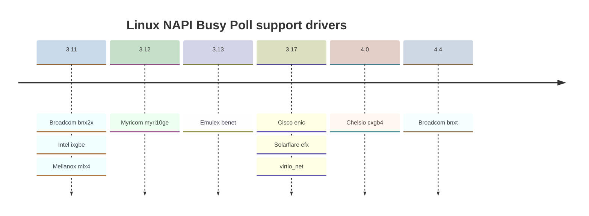
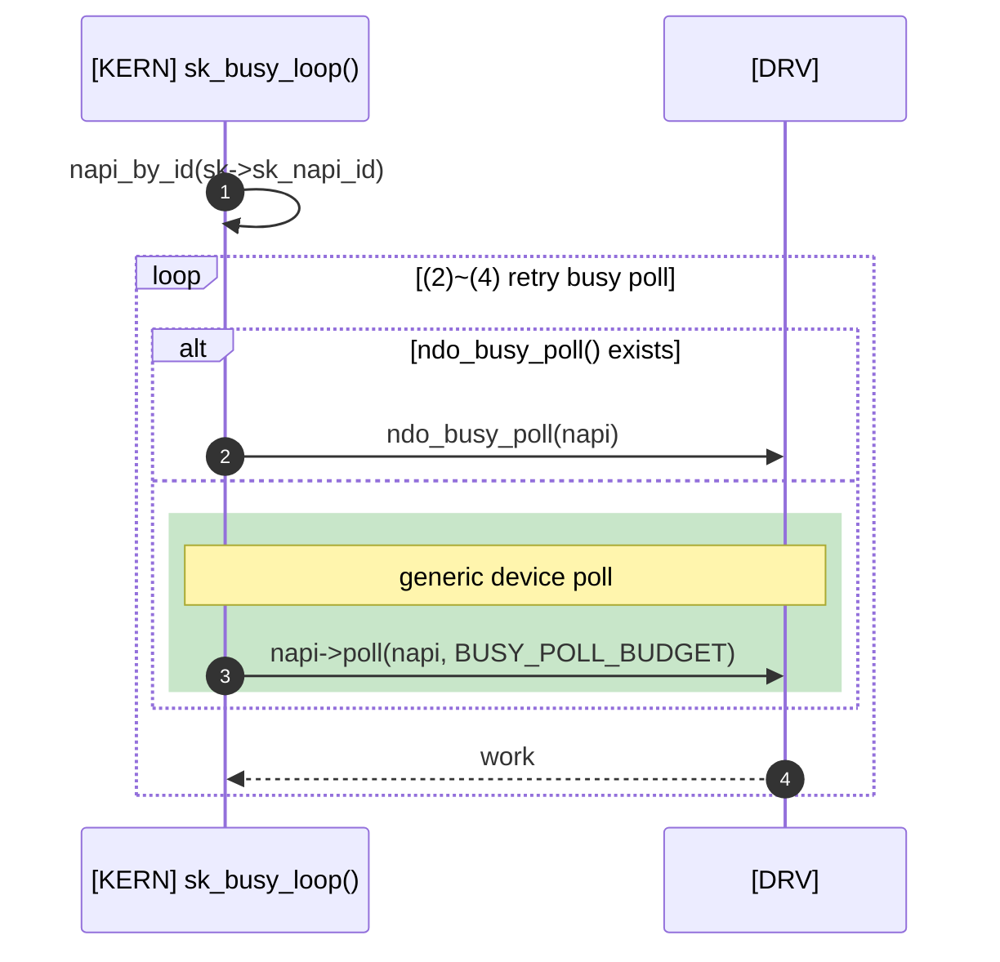
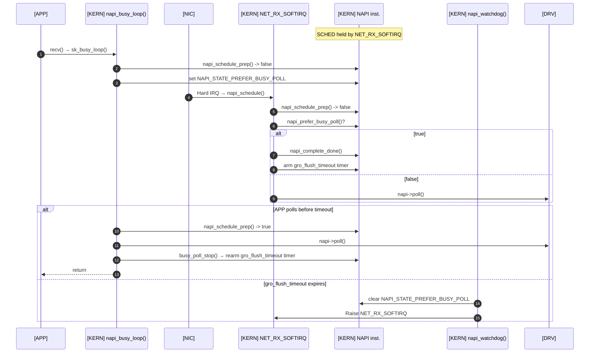

> Eric Dumazet이 Netdev 2.1(2017)에서 발표한 [BUSY POLLING](https://netdevconf.info/2.1/slides/apr6/dumazet-BUSY-POLLING-Netdev-2.1.pdf)과 [Busy Polling: Past, Present, Future](https://netdevconf.org/2.1/papers/BusyPollingNextGen.pdf)는 리눅스 4.x까지의 busy poll을 잘 설명하고 있습니다. 이 글에서는 해당 슬라이드를 기반으로, 리눅스 5.11에 추가된 preferred busy poll까지 다뤄보겠습니다.

# Generic device polling(Generic busy polling)

리눅스 3.11에 NAPI Busy Poll이 추가된 이후, 여러 이더넷 드라이버들이 이를 지원하기 시작했습니다. 아래는 각 드라이버의 지원 시점을 정리한 타임라인입니다.

각 이더넷 드라이버는 `ndo_busy_poll()` 콜백 함수를 구현했는데, 대부분의 경우 별도의 Busy Poll 로직을 구현하기보다는 `ndo_busy_poll()` 내에서 기존의 NAPI `poll()` 콜백 함수를 그대로 호출하는 방식으로 처리했습니다. 이로 인해 드라이버마다 같은 코드가 중복해 구현되는 문제점이 있었습니다. 또한, 이 방식대로라면 가상 장치를 포함한 어떤 네트워크 장치든 `ndo_busy_poll()`을 구현하는 것 자체는 어려운 일이 아니지만, 결국 장치마다 개별적으로 이를 추가해줘야 한다는 불편함이 있었습니다.

이러한 문제를 해결하기 위해 리눅스 4.5에서는 `Generic device poll`이 도입되었습니다. `Generic device poll`은 드라이버별 `ndo_busy_poll()` 없이도 `sk_busy_loop()`에서 NAPI `poll()` 콜백 함수를 직접 호출할 수 있도록 설계되었습니다.

> **loop (2)~(4) retry busy poll**: 다음 중 하나를 만족하면 종료
> - `sk->sk_receive_queue`가 비어 있지 않음
> - 타임아웃(`sk->sk_ll_usec`) 도달
> - `need_resched()`인 경우 `cond_resched()` 후 재시도하며, 위 조건을 아직 만족하지 못하면 폴링을 이어감

1. `sk->sk_napi_id`로 `napi_by_id()`를 통해 NAPI 인스턴스를 조회.
2. 드라이버가 `ndo_busy_poll()`을 구현했다면, 이를 직접 호출.
3. `ndo_busy_poll()`이 구현되지 않았다면, 드라이버의 `napi->poll()` 콜백 함수를 호출
4. 두 경로 모두 처리한 패킷 수(work)를 반환. 루프 조건에 따라 반복 또는 종료.

이 변경을 통해 NAPI 기반의 모든 이더넷 드라이버에서 NAPI Busy Poll을 사용할 수 있게 되었습니다. 또한, 이 패치에서는 NAPI ID를 기록하는 `skb_mark_napi_id()`가 NAPI API인 `napi_gro_receive()` 내부에서 기록하도록 변경되었습니다.

## Avoiding races between NAPI Busy Polls and `NET_RX_SOFTIRQ`

`NET_RX_SOFTIRQ`와 사용자 프로세스의 NAPI Busy Poll이 동시에 동일한 NIC 수신 큐를 처리하면, NIC 수신 큐 제어가 꼬이거나 패킷 순서가 뒤바뀌는 문제가 발생할 수 있습니다. 이러한 경쟁은 NAPI Busy Poll 수행 중에 `NET_RX_SOFTIRQ`가 발생하거나, 하나의 NAPI 인스턴스를 통해 패킷이 수신되는 여러 소켓이 동시에 Busy Polling할 때 발생하게 됩니다. Generic device polling이 도입되기 전에는, 이러한 문제를 방지하는 책임이 NIC 드라이버에 있었고, 대부분 lock을 사용해 이를 해결했습니다.

Generic device polling은 NAPI state를 활용하여, 이미 `NET_RX_SOFTIRQ`가 발생했거나 다른 사용자 프로세스가 NAPI Busy Poll을 수행 중인 경우에는 추가적인 Busy Poll을 수행하지 않도록 구현되었습니다. (`napi_schedule_prep()` 참조)

# Remove support for per driver ndo_busy_poll()

`Generic device polling`이 추가되면서 Mellanox의 mlx4, Broadcom의 bnx2x 등의 드라이버에서 `Device polling(ndo_busy_poll())` 지원이 중단되었고, 리눅스 4.11이 릴리즈되는 과정에서 나머지 드라이버가 `Device polling`을 지원하지 않게 됨에 따라, `ndo_busy_poll()` 콜백 함수는 제거되었습니다.

# epoll support

리눅스 4.12에서는 `epoll()` 시스템콜에서도 NAPI Busy Poll을 사용할 수 있게 되었습니다. 사실 `poll()`, `select()`에서 NAPI Busy Poll을 지원하게 된 리눅스 3.11에서도, `epoll()`을 지원하려던 시도가 있었습니다. [mail-1](https://www.spinics.net/lists/netdev/msg240512.html), [mail-2](https://www.spinics.net/lists/netdev/msg241328.html), [mail-3](https://www.spinics.net/lists/netdev/msg241341.html)

초기 PoC 구현은 `epoll()`이 관리하는 fd 중, 가장 최근에 LLS 이벤트가 발생한 fd를 기록하고 해당 fd를 기준으로 Busy Polling을 수행하는 방식이었습니다. 이후 디자인 논의를 통해 여러 fd를 Busy Polling하는 방향으로 진행되는 듯 하였지만, mainline에 포함되지 않았습니다. 아마도 많은 fd를 관리하는 데 효율이 좋은 `epoll()` 특성 상, 여러 fd를 Busy Polling 할 경우 latency에 악영향을 주기 때문이 아닐까 생각해봅니다.

리눅스 4.12에서는 `epoll()`에서 이벤트가 발생한 fd가 없는 경우에 한해, 가장 최근에 이벤트가 발생한 소켓의 NAPI ID 기준으로 Busy Polling 수행하는 방식으로 구현되었습니다.

# SO_PREFER_BUSY_POLL

NAPI Busy Poll은 높은 트래픽에서 의도대로 동작하지 않는 문제가 있었습니다. 패킷이 계속해서 수신되는 상황에서, `NET_RX_SOFTIRQ`가 종료되자마자 새로운 패킷에 의해 `NET_RX_SOFTIRQ`가 다시 발생합니다. 이로 인해 `NET_RX_SOFTIRQ`가 NAPI를 독점하게 되어 NAPI Busy Poll은 실행 기회를 잃게 됩니다. [Avoiding races 참조](#avoiding-races-between-napi-busy-polls-and-net_rx_softirq) [관련 커밋 참고](https://github.com/torvalds/linux/commit/7fd3253a7de6a317a0683f83739479fb880bffc8)

이를 해결하기 위해 리눅스 5.11에 도입된 소켓 옵션이 `SO_PREFER_BUSY_POLL`입니다. 이 옵션이 설정된 소켓이 NAPI Busy Poll을 수행하면, 이 때 사용된 NAPI 인스턴스의 state에 `NAPI_STATE_PREFER_BUSY_POLL`가 추가됩니다. 이후 패킷이 수신되어 `NET_RX_SOFTIRQ`가 실행될 때, NAPI 인스턴스의 state에 `NAPI_STATE_PREFER_BUSY_POLL`가 있다면 폴링하지 않고 종료합니다. 유저 프로세스가 다시 NAPI Busy Poll을 할 수 있도록 NAPI의 우선권을 양보하는 것입니다.

`SO_PREFER_BUSY_POLL`은 `gro_flush_timeout` 타이머와 `napi_defer_hard_irqs`를 함께 사용합니다. APP이 Busy Poll을 하지 않아 NAPI가 계속 방치되는 상황을 막기 위해, 일정 시간 후 `NET_RX_SOFTIRQ` 경로로 강제 복귀시키는 안전장치로 `gro_flush_timeout` 타이머를 둡니다. 이 타이머가 만료되기 전에 hwirq가 재활성화되어 NAPI를 곧바로 되찾아오면 안 되므로, `napi_defer_hard_irqs`로 hwirq 재활성화를 미룹니다.

> **alt APP polls before timeout**: `napi_busy_loop()`는 `sk->sk_receive_queue`가 비어 있지 않거나, 타임아웃(`sk->sk_ll_usec`) 도달, `need_resched()` 중 하나를 만족할 때까지 내부적으로 재시도합니다. 아래 흐름은 **true**(양보) 분기에서 이어지는 과정입니다.

1. APP이 `recv()`를 호출해 `sk_busy_loop()` → `napi_busy_loop()`로 진입.
2. `napi_busy_loop()`가 `napi_schedule_prep()`을 시도하지만 NAPI 인스턴스가 이미 `NET_RX_SOFTIRQ`에 의해 `SCHED` 상태라 실패.
3. 소유권을 얻지 못한 `napi_busy_loop()`가 `NAPI_STATE_PREFER_BUSY_POLL`을 NAPI state에 기록.
4. NIC이 Hard IRQ를 보내 인터럽트 핸들러가 `napi_schedule()`을 호출.
5. `napi_schedule()`이 내부적으로 `napi_schedule_prep()`을 시도하지만 NAPI 인스턴스가 이미 `SCHED` 상태([Avoiding races 참조](#avoiding-races-between-napi-busy-polls-and-net_rx_softirq))라 `NET_RX_SOFTIRQ`를 새로 발생시키지 않음.
6. `net_rx_action()`의 `napi_poll()`이 budget 소진 후 `napi_prefer_busy_poll()`로 플래그를 확인.
7. **(true)** `napi_complete_done()`이 `NAPI_STATE_PREFER_BUSY_POLL`과 `NAPI_STATE_SCHED`를 해제해 NAPI를 APP에 양보하고 `NET_RX_SOFTIRQ`를 빠져나감. `napi_defer_hard_irqs`가 설정되어 있으므로 false를 반환해 드라이버가 hwirq를 재활성화하지 않도록 함.
8. `gro_flush_timeout` 타이머를 arm.
9. **(false)** `napi_prefer_busy_poll()`이 false면(=`SO_PREFER_BUSY_POLL` 미설정) 드라이버 `poll()`을 호출해 평소처럼 처리.
10. `napi_busy_loop()`가 다시 `napi_schedule_prep()`을 시도해 이번엔 `SCHED`가 비어 있어 NAPI 소유권을 획득.
11. `napi_busy_loop()`가 드라이버 `poll()` 콜백 함수를 직접 호출.
12. `napi_busy_loop()`가 종료 조건을 만족해 `busy_poll_stop()`을 호출, `gro_flush_timeout` 타이머를 다시 설정.
13. `napi_busy_loop()`가 APP에 리턴.
- **(else)** APP이 타임아웃 전에 Busy Poll을 수행하지 않으면 `napi_watchdog()`가 실행됨.
14. `napi_watchdog()`가 `NAPI_STATE_PREFER_BUSY_POLL`를 제거.
15. `napi_watchdog()`가 `NET_RX_SOFTIRQ`를 발생시켜 정상 폴링 경로로 복귀시킴.
